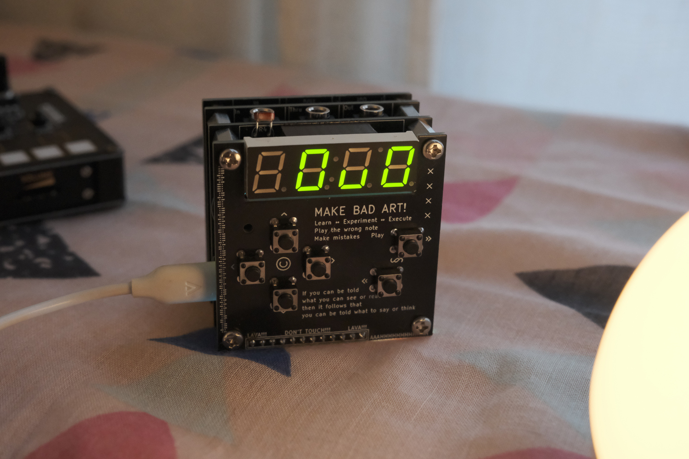

# Grandbot

Grandbot is a robot grand-child for my parents. He's my my take on [Mohit Bhoite's Chintoo](https://twitter.com/MohitBhoite/status/1241752124087660546).

- [Demo](https://www.youtube.com/watch?v=sPIsFCZO8Fg)
- [Synth jams](https://www.youtube.com/watch?v=bJeONx7aBzU)
- [Build video](https://www.youtube.com/watch?v=zd_m1_4YeL4)

## Features

- Grandbot is a generative, pattern-based MIDI arpeggiator
- He has different moods based on his self-esteem. These moods affect everything from his expressions, the color of his light, and the sounds he plays.
  - To increase his self-esteem, it's important to give him plenty of attention. He currently can be interacted with using a "play" button; if you play with him, he feels better about himself and he gets happier.
  - He doesn't like to be ignored though. If you don't play with him regularly, he starts to feel unimportant. If his self-esteem drops too low, he gets depressed.
- He uses a photoresistor to determine when to go to sleep and when to wake up.
- He has an onboard passive buzzer and uses it to make music. The music is mostly randomly generated and is influenced by his mood.
- He likes to set mood lighting using an RGB LED as another indicator of how he's feeling.

## Arp

I had extra memory, so I decided to program Grandbot to play synths with me. He's now a chaotic, generative, pattern-based arpeggiator.

This requires the additional MIDI board for Grandbot.

The simplest use:

- Plug something that can send MIDI notes and a MIDI clock to Grandbot's MIDI input
- Plug Grandbot's MIDI out into a synth
- Start the MIDI clock and play some notes
- Press the button to generate a new sequence

There's endless potential just doing that. If you'd like more control, there are additional parameters that can be changed using MIDI CC or the optional Grandbot control board.

[**>> FULL GUIDE <<**](guide.md)

## Blog Posts

Grandbot development is what I'm using to learn more about electronics and C++. I write about what I've been learning on my blog. Here are the Grandbot posts:

- [Grandbot: Sleep](https://handeyeco.github.io/tech-blog/grandbot-update-sleep/)
- [Grandbot: Voice](https://handeyeco.github.io/tech-blog/grandbot-update-voice/)
- [Grandbot: Play](https://handeyeco.github.io/tech-blog/grandbot-update-play/)
- [Grandbot: Light](https://handeyeco.github.io/tech-blog/grandbot-update-light/)
- [Grandbot: MIDI & Misc](https://handeyeco.github.io/tech-blog/grandbot-update-midi/)
- [Grandbot: Arp](https://handeyeco.github.io/tech-blog/grandbot-update-arp/)
- [Grandbot: Buttons](https://handeyeco.github.io/tech-blog/grandbot-update-buttons/)
- [Concurrent Arduino](https://handeyeco.github.io/tech-blog/concurrent-arduino/)
- [4 Digit, 7 Segment Emoji](https://handeyeco.github.io/tech-blog/seven-segment-emoji/)
- [Max7219 Emoji](https://handeyeco.github.io/tech-blog/max7219-emoji/)

## Nano vs Nano Every

This was originally built on a cheap Arduino Nano clone.

However I wanted to be able to support 8 bars of 32nd notes in the arpeggiator (the minimum base note length is 16th, but ratchets break that into 32nds) and the Arduino Nano didn't have enough memory. The [Arduino Nano Every](https://store.arduino.cc/products/arduino-nano-every) does! **It's a different board with a similar name.**
